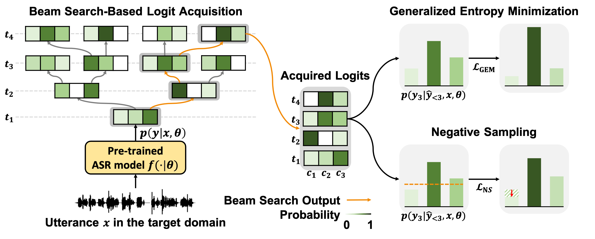

# SGEM: Test-Time Adaptation for Automatic Speech Recognition via Sequential-Level Generalized Entropy Minimization (INTERSPEECH 2023 Oral Presentation)



## Introduction
This repository contains the official PyTorch implementation of the following paper:

> [**SGEM: Test-Time Adaptation for Automatic Speech Recognition via Sequential-Level Generalized Entropy Minimization**](https://arxiv.org/abs/2306.01981)<br>
> Changhun Kim, Joonhyung Park, Hajin Shim and Eunho Yang<br>
> Conference of the International Speech Communication Association (INTERSPEECH), 2023, **(Oral Presentation, 348/2293=15.18%)**
>
> **Abstract:** *Automatic speech recognition (ASR) models are frequently exposed to data distribution shifts in many real-world scenarios, leading to erroneous predictions. To tackle this issue, an existing test-time adaptation (TTA) method has recently been proposed to adapt the pre-trained ASR model on unlabeled test instances without source data. Despite decent performance gain, this work relies solely on naive greedy decoding and performs adaptation across timesteps at a frame level, which may not be optimal given the sequential nature of the model output. Motivated by this, we propose a novel TTA framework, dubbed SGEM, for general ASR models. To treat the sequential output, SGEM first exploits beam search to explore candidate output logits and selects the most plausible one. Then, it utilizes generalized entropy minimization and negative sampling as unsupervised objectives to adapt the model. SGEM achieves state-of-the-art performance for three mainstream ASR models under various domain shifts.*


## Environmental Setup
```
conda create -y -n sgem python=3.7
conda activate sgem
pip install -r requirements.txt
```


## Datasets
- [LibriSpeech](https://www.openslr.org/12)
  - You can get test-other.tar.gz in LibriSpeech using the link above.
- [CHiME-3](https://catalog.ldc.upenn.edu/LDC2017S24)
  - You need to manually download CHiME-3 dataset using the link above with a ``standard Linguistic Data Consortium account``.
- [TED-LIUM 2](https://lium.univ-lemans.fr/ted-lium2/)
  - You can get TED-LIUM 2 dataset using the link above.
  - You also need to preprocess the data with data/preprocess_ted.py and data/preprocess_ted.sh.
- [CommonVoice](https://tinyurl.com/cvjune2020)
  - You can get en.tar.gz in CommonVoice dataset using the link above.
- [Valentini](https://datashare.ed.ac.uk/handle/10283/2791)
  - You can get noisy_testset_wav.zip and testset_txt.zip in TED-LIUM 2 dataset using the link above.
- [L2-Arctic](https://psi.engr.tamu.edu/l2-arctic-corpus/)
  - You can get L2-Arctic dataset using the link above.
  - Speakers who were utilized for each native language are as follows:

  Language | Speaker
  --- | ---
  Arabic | SKA
  Mandarin | BWC
  Hindi | RRBI
  Korean | HKK
  Spanish | EBVS
  Vietnamese | PNV
- [MS-SNSD](https://github.com/microsoft/MS-SNSD)
  - All background noises used in the paper are included in res folder. (res/*.wav)
  - Set ``speech_dir`` and ``snr_lower`` in ``conf/noisyspeech_synthesizer.cfg``.
  - You can make synthetic distribution shift datasets with the following command:
  ```
  python corpus/noisyspeech_synthesizer.py
  ```


## Pre-trained Models
- [CTC-based Model](https://huggingface.co/facebook/wav2vec2-base-960h)
  - CTC-based model will be automatically downloaded if you set ``asr`` as ``facebook/wav2vec2-base-960h``.
- [Conformer](https://catalog.ngc.nvidia.com/orgs/nvidia/teams/nemo/models/stt_en_conformer_ctc_small_ls)
  - You need to download conformer by your own using following command:
  ```
  wget --content-disposition https://api.ngc.nvidia.com/v2/models/nvidia/nemo/stt_en_conformer_ctc_small_ls/versions/1.0.0/zip -P pretrained_models
  ```
- [Transducer](https://catalog.ngc.nvidia.com/orgs/nvidia/teams/nemo/models/stt_en_conformer_transducer_small)
  - You need to download transducer by your own using following command:
  ```
  wget --content-disposition https://api.ngc.nvidia.com/v2/models/nvidia/nemo/stt_en_conformer_transducer_small/versions/1.6.0/zip -P pretrained_models
  ```
- [4-gram Language Model for CTC-based Model](https://huggingface.co/patrickvonplaten/wav2vec2-base-100h-with-lm)
  - You need to download language by your own using following command:
  ```
  git lfs install
  git clone https://huggingface.co/patrickvonplaten/wav2vec2-base-100h-with-lm pretrained_models/wav2vec2-base-100h-with-lm
  ```


## Run
You can run main.py using the command below:
```
python main.py \
    --config-name [CONFIG.YAML] \
    dataset_name=[DATASET_NAME] \
    dataset_dir=[DATASET_DIR] \
```
Currently available parameters are as follows:

  Parameter | Value
  --- | ---
  CONFIG.YAML | config.yaml, config_{sgem\|suta}_{ctc\|conformer\|transducer}.yaml
  DATASET_NAME | librispeech, chime, ted, commonvoice, valentini, l2arctic


## Citation
```
@inproceedings{kim2023sgem,
  title={{SGEM}: Test-Time Adaptation for Automatic Speech Recognition via Sequential-Level Generalized Entropy Minimization},
  author={Changhun Kim and Joonhyung Park and Hajin Shim, and Eunho Yang},
  booktitle={Conference of the International Speech Communication Association (INTERSPEECH)},
  year={2023}
}
```


## Contact
If you have any questions or comments, feel free to contact us via changhun.kim@kaist.ac.kr.
